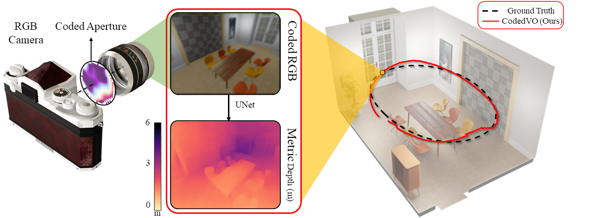

# CodedVO: Coded Visual Odometry

Official implementation of **"CodedVO: Coded Visual Odometry"** accepted in IEEE Robotics and Automation Letters, 2024.

[**Project page**](http://prg.cs.umd.edu/CodedVO) | [**IEEE Xplore**](https://ieeexplore.ieee.org/abstract/document/10564186) | [**arXiv**](https://arxiv.org/pdf/2407.18240)



## Video

[](https://www.youtube.com/watch?v=5MOlGOLvtS4)

## Citation

If you use this code in your research, please cite:

```bibtex
@ARTICLE{codedvo2024,
  author={Shah, Sachin and Rajyaguru, Naitri and Singh, Chahat Deep and Metzler, Christopher and Aloimonos, Yiannis},
  journal={IEEE Robotics and Automation Letters}, 
  title={CodedVO: Coded Visual Odometry}, 
  year={2024},
  doi={10.1109/LRA.2024.3416788}}
```
## Table of Contents

1. [Introduction](#introduction)
2. [Installation](#installation)
   - [Clone Repository](#clone-repository)
   - [Environment Setup](#environment-setup)
3. [Models](#models)
   - [Download Pre-trained Models](#download-pre-trained-models)
4. [Dataset](#dataset)
   - [Download and Setup](#download-and-setup)
   - [Dataset Structure](dataset-structure)
   - [Generate Coded Images](#generate-coded-images)
5. [Training](#training)
   - [Train from Scratch](#train-from-scratch)
6. [Evaluation](#evaluation)
7. [Usage](#usage)
   - [Run Visual Odometry](#run-visual-odometry)
8. [Contributions](#contributions)

## Introduction
- A novel method for estimating monocular visual odometry that leverages RGB and metric depth estimates obtained through a phase mask on a standard 1-inch camera sensor.
- A depth-weighted loss function designed to prioritize learning depth maps at closer distances.
- Evaluation in zero-shot indoor scenes without requiring a scale for evaluation.

## Installation

### Clone Repository

```bash
git clone https://github.com/naitri/CodedVO
cd CodedVO
```

### Environment Setup

```bash
 conda env create -f environment.yml
```

## Models

### Download Pre-trained Models
We provide our metric depth-weighted loss pre-trained model, which has been benchmarked on various indoor datasets. 
[Download Pre-trained Models](https://drive.google.com/drive/folders/1N8GyIXZe1DBrKiHNpmL3U363nQy-Rwi8?usp=sharing)

## Dataset

### Download and Setup
We provide the training dataset, which includes the UMD-CodedVO dataset LivingRoom and NYU data, each containing 1000 images. The dataset also includes coded blur RGB images. 
- [Training data](https://drive.google.com/drive/folders/12GrDxTBMaSlGeMRWycxmCQl01BHnC5-O?usp=sharing)

Additionally, we provide UMD-CodedVO dataset which includes ground truth depth, RGB images, coded blur RGB images, and trajectory information.
- [UMD-CodedVO Dataset](https://drive.google.com/drive/folders/12U8BH-AWUA4DgbOValO-_hNI_Z9RgMXr?usp=sharing)

### Dataset Structure
```
├── README.md
├── datasets
│   └── nyu_data
│       ├── rgb
│       ├── depth
│       └── Codedphasecam-27Linear
│   └── ...
├── scripts
│   └── ...
├── weights
│   └── ...
```

### Generate Coded Images
To generate coded blur RGB images from your own data, you can use the script `coded-generator.py`. 

```bash
cd scripts
python coded_generator.py --root /path/to/your/data --scale_factor YOUR_SCALE_FACTOR
```
- Scale factor for NYUv2 dataset is 1000, UMD-CodedVO-dataset is 1 and ICL-NUIM dataset is 5000.
- root path should be fodler contianing rgb, depth, Codedphasecam-27Linear. for e.g. ./datasets/nyu_data

Note: Our Point Spread Functions (PSFs) correspond to discretized depth layers using a 23×23 Zernike parameterized phase mask,with the depth range discretized into 27 bins within the interval of [0.5, 6] meters, with a focal distance of 85 cm.

## Training

### Train from Scratch
To train your data or our given dataset :
```bash
 python trainer.py --config MetricWeightedLossBlenderNYU --datasets /path/to/dataset/folder
```
- You can add different configurations for loss and depth space in config.py and use those configurations for training. In this example, we use MetricWeightedLossBlenderNYU for our pre-trained weight file.
- You can also change the training or test dataset in config.py by modifying lines 19-31.

## Evaluation
The evaluation script can be executed as follows:
```bash
python evaluate.py --CONFIG MetricWeightedLossBlenderNYU --DATASET /path/to/dataset/folder --OUTPUT /path/to/output/folder --CHECKPOINT /path/to/checkpoint/file
``` 

## Usage

### Run Visual Odometry
We use ORB-SLAM after disabling the loop closure. Predicted depth maps from the above models are used to compute the odometry. Follow the [ORB-SLAM2](https://github.com/raulmur/ORB_SLAM2) RGBD execution instructions. Note that we do not use coded blur RGB images directly. As mentioned in the paper, we apply [unsharp masking](https://www.mathworks.com/help/images/ref/imsharpen.html) on them for computing odometry.

## Acknowledgements
We would like to thank authors of [Phasecam3D](https://github.com/YichengWu/PhaseCam3D) and [ORB-SLAM2](https://github.com/raulmur/ORB_SLAM2) for opensourcing codebase.

## Contributions
If you have any questions/comments/bug reports, feel free to open a github issue or pull a request or e-mail to the authors [Naitri Rajyaguru](mailto:nrajyagu@umd.edu) or [Sachin Shah](mailto:shah2022@umd.edu)

